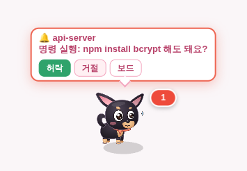
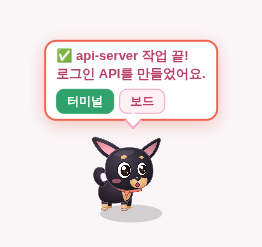
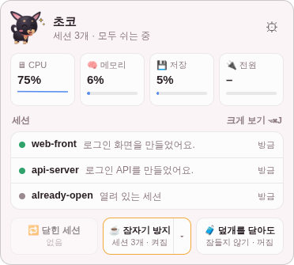
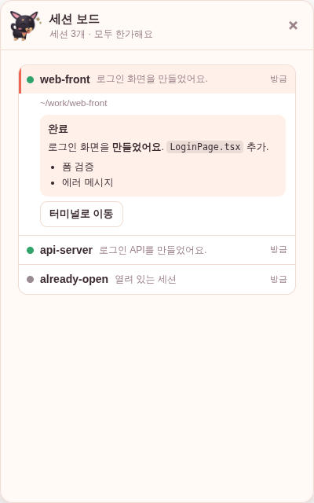

# 🐶 CodePup — Claude 가 나를 기다리면 달려와서 알려주는 강아지

> Claude Code 에게 일 맡겨 놓고 딴 거 하다가, **허락(y/n) 창에서 멈춘 줄도 모르고 있었거나, 작업이 끝난 걸 뒤늦게 알아서** 시간을 날린 적이 있나요? ~~dangerously-skip-permissions~~
> 
> CodePup 은 화면 구석을 걸어 다니다가, 세션이 나를 부르면 달려와서 **그 자리에서 허락 · 거절**하게 해 줘요.
>
> 멀티-태스킹 시대에 필요한 댕댕이 하나 입양하는 것. 어떠신가요?
> 
> remote control을 자주 사용하는 유저라면, 세션 관리도 편하게 할 수 있어요!

<p>
  
  
</p>

#### 시연 영상
<p>

https://github.com/user-attachments/assets/f043bec9-f1dd-4030-aac1-b6e0e3b2b973

</p>

#### 유튜브 (이미지 클릭)
<a href="https://www.youtube.com/watch?v=mUoc2aJu2hA" target="_blank" rel="noopener noreferrer">
  
</a>

## ⬇️ 설치 (macOS · 1분)

1. **[최신 버전 받기](https://github.com/madirony/codepup/releases/latest)** — M1~M4 맥은 `arm64`, 인텔 맥은 `x64` dmg
2. dmg 를 열고 **CodePup** 을 **Applications** 폴더로 끌어다 놓기
3. **터미널에서 한 번 꼭 실행** (서명이 없는 앱이라 안 하면 "손상된 앱"으로 막혀요)
   ```sh
   xattr -cr /Applications/CodePup.app
   ```
4. CodePup 을 열고 **[Claude Code 연결]** 클릭 → 끝!

> 세션을 다시 열 때 macOS 가 **자동화 · 손쉬운 사용** 권한을 물으면 허용해 주세요. iTerm 플러그인 같은 건 필요 없어요.

## ✨ 할 수 있는 것

| | |
| --- | --- |
| 🔔 **그 자리에서 허락** | 허락이 필요하면 펫이 달려와서 **[허락] [거절]**. 터미널로 안 가도 세션이 바로 진행돼요 |
| ✅ **작업 끝 알림** | 끝나면 "작업 끝!"과 답변 첫 문장. 평소엔 조용해서 **소리가 나면 = 나를 부르는 것** |
| 🐾 **메뉴 막대 팝오버** | 강아지 아이콘을 누르면 허락 대기 · 세션 목록 · CPU · 메모리 · 배터리를 한눈에 |
| 🗂 **세션 보드** (⌥⌘J) | 세션이 10개여도 기다리는 것만 크게, 나머지는 한 줄씩. 답변은 마크다운으로 깔끔하게 |
| 🔁 **닫힌 세션 골라서 다시 열기** | 터미널을 닫아 버린 세션을 골라서 쓰던 창에 탭으로. 원래 권한 모드 · 원격 제어(--rc) 그대로 |
| ☕ **잠자기 방지** | 세션이 열려 있는 동안 맥이 안 잠들어요. 외출할 땐 "덮개를 닫아도 잠들지 않기" |

<p>
  
</p>
<p>
  
</p>

기본 캐릭터는 블랙탄 치와와 **'초코'**, 스킨으로 **스피키**도 들어 있어요.

## 🙋 자주 묻는 것

<details>
<summary><b>이거 써도 계정 정지 안 당해요?</b></summary>

Claude Code 의 **공식 훅** 기능만 써요. API 를 부르지 않고, 로그인 정보를 만지지 않고, 대신 프롬프트를 보내지도 않아요. 모든 통신은 내 컴퓨터 안(127.0.0.1)에서만 해요. 허락도 **내가 버튼을 눌러야** 진행돼요 (절대 자동으로 허락하지 않아요).
</details>

<details>
<summary><b>이미 열어 둔 세션도 알려 주나요?</b></summary>

보드 · 팝오버에 바로 떠요. 다만 Claude Code 는 세션을 시작할 때 훅을 읽어서, 연결 전에 연 세션은 🔕 알림이 꺼져 있어요. **[🔔 알림 켜기]** 한 번이면 같은 탭에서 그대로 이어서 다시 열려요.
</details>

<details>
<summary><b>어떤 세션을 "다시 열기" 해 주나요?</b></summary>

터미널 창이 닫히거나 맥이 꺼져서 **갑자기 사라진 세션만**요. `/exit` 로 직접 끝낸 세션은 되살리지 않아요. iTerm 이 있으면 iTerm, 없으면 기본 터미널로 열고, 설정에서 고정할 수 있어요.
</details>

<details>
<summary><b>게임 · 전체 화면에서도 보여요?</b></summary>

전체 화면 앱(터미널 · IDE · 유튜브) 위에도 떠요. 롤 같은 게임의 전체 화면 · 테두리 없음 모드는 게임이 화면을 독점해서 안 보이고, **창 모드**에서는 보여요.
</details>

<details>
<summary><b>끄거나 지우고 싶어요</b></summary>

설정 → Claude Code → [연결 해제] 를 누르면 추가한 훅을 지우고 원래 설정으로 돌아가요. 처음 연결할 때 `~/.claude/settings.json.codepup-backup` 백업도 남겨 둬요. 앱이 꺼져 있으면 Claude Code 에 아무 영향이 없어요.
</details>

---

<details>
<summary>🛠 개발자용 (구조 · 빌드 · 스킨 만들기)</summary>

### 동작 방식
```
Claude Code 세션들 ──(공식 훅)──▶ ~/.codepup/codepup-hook.sh ──curl 127.0.0.1 + 토큰──▶ CodePup ──▶ 말풍선 · 팝오버 · 보드
```
- 브리지는 내 컴퓨터(127.0.0.1)에서만 열리고, 앱을 켤 때마다 바뀌는 토큰으로 잠겨요.
- 이미 돌고 있는 세션은 `ps` · `lsof` 와 `~/.claude/projects` 대화 기록으로 찾아요.
- 상태 표시줄(`statusLine`)은 건드리지 않아요. claude-hud 등은 그대로예요.

### 빌드 · 테스트
```bash
npm install
npm start          # 개발 모드
npm test           # 단위 테스트
npm run dist:mac   # dmg 빌드 (macOS)
SMOKE_OUT=/tmp/smoke xvfb-run -a npx electron test/smoke-main.js --no-sandbox   # 전체 흐름 스모크 테스트
```
`main` 에 push 하면 GitHub Actions 가 테스트 후 dmg 를 빌드하고, `package.json` 버전의 Release 가 없으면 자동으로 만들어요.

### 스킨 만들기
`skin.json` (또는 `default.png` 등 표정 이름 이미지)이 든 폴더를 설정 → 커스텀 → [스킨 폴더 불러오기] 로 넣으면 돼요.
```json
{
  "name": "우리 집 고양이",
  "defaultName": "나비",
  "catchphrase": "냐옹",
  "voice": { "type": "babble", "pitch": 1.6 },
  "images": { "default": "default.png", "happy": "happy.png", "alert": "alert.png", "worry": "worry.png", "sleep": "sleep.png" },
  "sounds": { "done": ["done.mp3"] },
  "soundRepeat": { "done": 2 }
}
```

### 구조
```
src/main/       main.js (창 · IPC) · sessions.js (세션 허브) · bridge.js (훅 · 브리지) · terminals.js (터미널 제어)
                tray.js (메뉴 막대) · keep-awake.js · transcripts.js · skins.js · pet-state.js · store.js
src/renderer/   pet/ (펫) · popover/ (메뉴 막대 팝오버) · panel/ (세션 보드) · settings/ (설정) · shared/
assets/skins/   chihuahua (기본) · speaki (팬메이드)
```
</details>

*스피키 스킨: 트릭컬 / Trickcal — 비상업적 팬 메이드*
